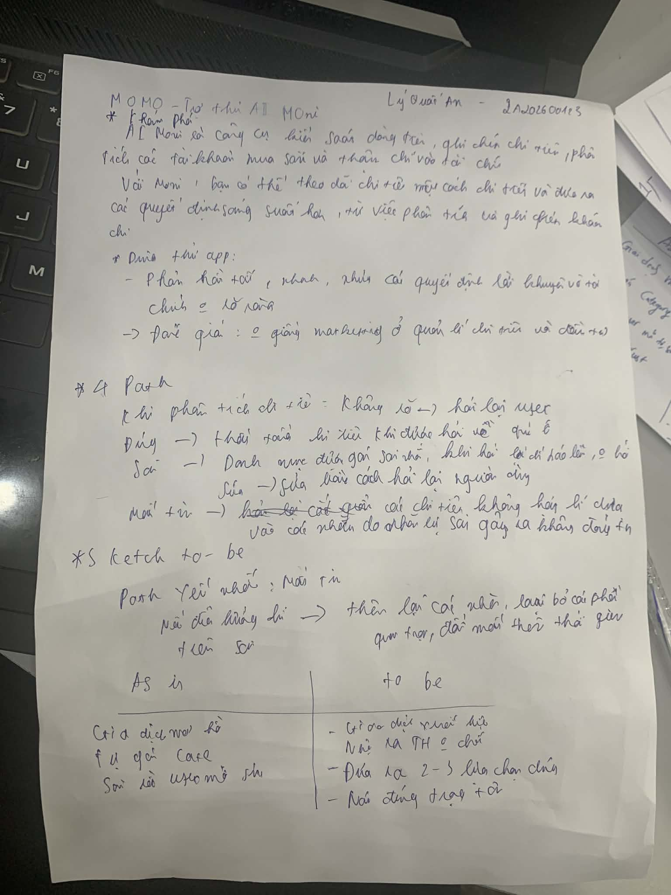

# UX exercise — MoMo Moni AI

## Sản phẩm: MoMo — Moni AI Assistant (phân loại chi tiêu)

## 4 paths

### 1. AI đúng
- User hỏi về chi tiêu của bản thân trong năm trả ra chi tiêu
- User thấy tag đúng, không cần làm gì thêm
- UI: hiện số liệu , bảng chi tiêu 

### 2. AI không chắc
- User hỏi về vấn đề sức khỏe của bản thân
- UI: không hiển thị cần cung cấp thêm thông tin 
- Vấn đề: không có cơ chế "thông tin sức khỏe"

### 3. AI sai
- user hỏi các loại giao dịch 
- UI: hiển thị nhãn bụ sai cần user phản hồi lại 

### 4. User mất niềm tin
- user hỏi các loại giao dịch 
- UI: hiển thị nhãn bị sai cho tối ưu cắt giảm chi phí , làm bị sai 
## Path yếu nhất:  4
- thiếu dữ kiện gán nhãn cho giao dịch , cần verify lại

## Gap marketing vs thực tế
- Marketing: "Moni giúp quản lý chi tiêu thông minh"
- Thực tế: auto-tag chỉ đúng ~70% cho giao dịch phổ biến, các trường hợp edge case
  (chuyển tiền, mua online) thường bị tag sai hoặc không tag
- Gap lớn nhất: marketing không nói về khi AI sai — user kỳ vọng 100% chính xác

## Sketch

- As-is: giao dịch → auto-tag → user thấy kết quả → nếu sai phải vào sửa thủ công
- To-be: giao dịch → auto-tag → nếu confidence thấp: hiện "Bạn muốn phân loại?"
  → user chọn → AI ghi nhận correction → hiện "Đã học, lần sau sẽ chính xác hơn"
- As-is: câu trả lời chưa rõ ràng
- To-be: hiển thị chi tiết kế hoạch
